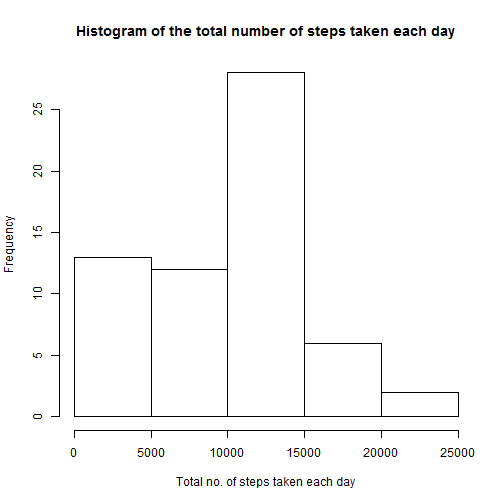
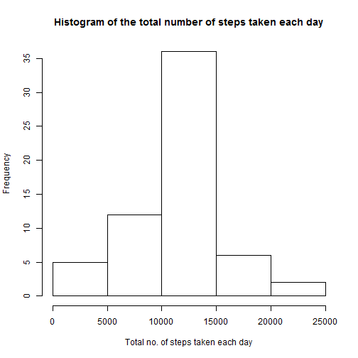

## Introduction

This assignment makes use of data from a personal activity monitoring device. This device collects data at 5 minute intervals through out the day. The data consists of two months of data from an anonymous individual collected during the months of October and November, 2012 and include the number of steps taken in 5 minute intervals each day.


### Loading and preprocessing the data

Init


```r
# init lib
library(lubridate)
library(lattice) 
```

Show any code that is needed to

1. Load the data (i.e. read.csv())

Note: do ensure that the file is in the working directory

```r
data_raw <- read.csv("activity.csv") 
```

2. Process/transform the data (if necessary) into a format suitable for your analysis

Formatting changes: 
1. Change date to date format.


```r
data_main <- data_raw
data_main$date <- as.Date(data_main$date , "%Y-%m-%d")
```


### What is mean total number of steps taken per day?

For this part of the assignment, you can ignore the missing values in the dataset.

Make a histogram of the total number of steps taken each day


```r
data_sum <- aggregate(data_main$steps, by= list(date = data_main$date), FUN= sum, na.rm=TRUE)
hist(data_sum$x, xlab = "Total no. of steps taken each day", main = "Histogram of the total number of steps taken each day")
```

 

Calculate and report the mean and median total number of steps taken per day

Mean : 


```r
mean(data_sum$x)
```

```
## [1] 9354.23
```

Median : 


```r
median(data_sum$x)
```

```
## [1] 10395
```


### What is the average daily activity pattern?

Make a time series plot (i.e. type = "l") of the 5-minute interval (x-axis) and the average number of steps taken, averaged across all days (y-axis)


```r
data_ave <- aggregate(data_main$steps, by= list(interval = data_main$interval), FUN= mean, na.rm=TRUE)
plot(data_ave$interval, data_ave$x , type = "l", ylab = "Average number of steps", main = "Average daily activity pattern", xlab = "Interval")
```

 

Which 5-minute interval, on average across all the days in the dataset, contains the maximum number of steps?


```r
var_max <- data_ave[data_ave$x == max(data_ave$x),]
```

5-minute interval: **835**


### Imputing missing values

Note that there are a number of days/intervals where there are missing values (coded as NA). The presence of missing days may introduce bias into some calculations or summaries of the data.

Calculate and report the total number of missing values in the dataset (i.e. the total number of rows with NAs)


```r
var_missval <- nrow(data_raw[is.na(data_raw),])
```

Total number of missing values in the dataset: **2304**

Devise a strategy for filling in all of the missing values in the dataset. The strategy does not need to be sophisticated. For example, you could use the mean/median for that day, or the mean for that 5-minute interval, etc.

Create a new dataset that is equal to the original dataset but with the missing data filled in.


```r
data_main2 <- data_main
# reusing data_ave, replacing NAs with average of 5 min interval
data_main2 <- merge(data_main2, data_ave, by = "interval")
data_main2$steps[is.na(data_main2$steps)] <- data_main2$x[is.na(data_main2$steps)]
data_main2 <- subset(data_main2, select = c(interval, steps, date))
```


Make a histogram of the total number of steps taken each day and Calculate and report the mean and median total number of steps taken per day. Do these values differ from the estimates from the first part of the assignment? What is the impact of imputing missing data on the estimates of the total daily number of steps?


```r
data_sum2 <- aggregate(data_main2$steps, by= list(date = data_main2$date), FUN= sum, na.rm=TRUE)
hist(data_sum2$x, xlab = "Total no. of steps taken each day", main = "Histogram of the total number of steps taken each day")
```

 

Mean : 


```r
mean(data_sum2$x)
```

```
## [1] 10766.19
```

Median : 


```r
median(data_sum2$x)
```

```
## [1] 10766.19
```

The values of mean and median is higher when missing values are replaced by average of 5 min interval. As a whole, the data is less skewed.


### Are there differences in activity patterns between weekdays and weekends?

For this part the weekdays() function may be of some help here. Use the dataset with the filled-in missing values for this part.

Create a new factor variable in the dataset with two levels - "weekday" and "weekend" indicating whether a given date is a weekday or weekend day.


```r
data_main3 <- data_main2
col_day <- wday(data_main3$date , label = TRUE)
fun_day <- function(x) { if(x == 'Sun' || x == 'Sat') {'weekend'} else {'weekday'} }
col_day <- sapply(col_day,fun_day)
data_main3 <- cbind(data_main3, col_day)
```

Make a panel plot containing a time series plot (i.e. type = "l") of the 5-minute interval (x-axis) and the average number of steps taken, averaged across all weekday days or weekend days (y-axis). See the README file in the GitHub repository to see an example of what this plot should look like using simulated data.


```r
data_ave2 <- aggregate(data_main3$steps, by= list(col_day = data_main3$col_day, interval = data_main3$interval), FUN= mean, na.rm=TRUE)
xyplot(x ~ interval | col_day, data = data_ave2, layout = c(1, 2), type = "l", ylab = "Number of steps", xlab = "Interval")
```

 

